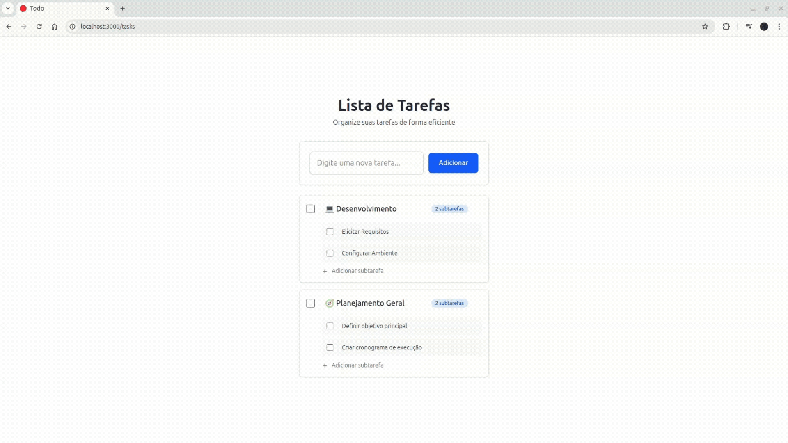

# 📋 To-Do List

Um projeto de aplicação To-Do List full-stack para gerenciar tarefas. O objetivo é criar um sistema com funcionalidades de CRUD (Criar, Ler, Atualizar, Deletar) tanto para tarefas principais quanto para sub-tarefas aninhadas.

O desenvolvimento deste projeto é gerenciado através de um board Kanban no [GitHub Projects](https://github.com/users/raqueleucaria/projects/8).

## ✨ Funcionalidades Planejadas

-   [x] **Criação de Tarefas:** Adicionar novas tarefas à lista.
-   [x] **Visualização de Tarefas:** Ver todas as tarefas pendentes e concluídas.
-   [x] **Atualização de Tarefas:** Editar o nome e o status (concluída/pendente) de uma tarefa.
-   [x] **Exclusão de Tarefas:** Remover tarefas, sub-tarefas individuais e todas da lista.
-   [x] **Gestão de Sub-tarefas:** Adicionar, editar e excluir sub-itens dentro de uma tarefa principal.



## Tecnologias Utilizadas

| Categoria      | Tecnologia                                                              |
|----------------|-------------------------------------------------------------------------|
| **Backend**    | [Ruby on Rails 8](https://rubyonrails.org/)                             |
| **Frontend**   | [Hotwire](https://hotwired.dev/) (Turbo + Stimulus)                     |
| **Estilização**| [TailwindCSS](https://tailwindcss.com/)                                 |
| **Banco de Dados** | SQLite3 (Desenvolvimento/Teste), PostgreSQL (Produção)                |
| **Servidor**   | [Puma](https://puma.io/)                                                |


## Instalação

1.  **Clone o repositório:**
    ```bash
    git clone https://github.com/seu-usuario/todo-rails-hotwire.git
    cd todo-rails-hotwire
    ```

2.  **Instale as dependências do Ruby:**
    ```bash
    bundle install
    ```

3.  **Instale as dependências do JavaScript:**
    ```bash
    yarn install
    # ou, se não tiver o yarn:
    # npm install
    ```

4.  **Crie e configure o banco de dados:**
    Este comando irá criar o banco de dados SQLite, carregar o schema e popular com dados de exemplo (se houver).
    ```bash
    rails db:prepare
    ```

5.  **Inicie o servidor Rails:**
    ```bash
    ./bin/dev
    ```

6.  **Acesse a aplicação:**
    Abra seu navegador e acesse [http://localhost:3000](http://localhost:3000).

<!--

## 🚀 Tecnologias Utilizadas

Este projeto será construído com as seguintes tecnologias:

-   **Backend:** 
-   **Frontend:** 
-   **Banco de Dados:** 
-   **Infraestrutura/Deploy:**  

## 💻 Como Começar

Siga os passos abaixo para configurar e rodar o projeto localmente.

**Pré-requisitos:**
* x

**Instalação:**

1.  **Clone o repositório:**
    ```bash
    git clone repo
    cd repo
    ```

2.  **Instale as dependências do Backend:**
    ```bash
    cd backend
    npm install
    ```

3.  **Instale as dependências do Frontend:**
    ```bash
    cd frontend
    npm install
    ```

4.  **Configure as variáveis de ambiente:**
    - Crie um arquivo `.env` na pasta `backend` a partir do `.env.example`.
    - Preencha as variáveis, como as credenciais do banco de dados.

5.  **Inicie o projeto:**
    ```bash
    # Em um terminal, inicie o backend
    cd backend

    # Em outro terminal, inicie o frontend
    cd frontend

    ```

## 📝 Licença

Este projeto está sob a licença MIT. Veja o arquivo [LICENSE](LICENSE) para mais detalhes. 

-->